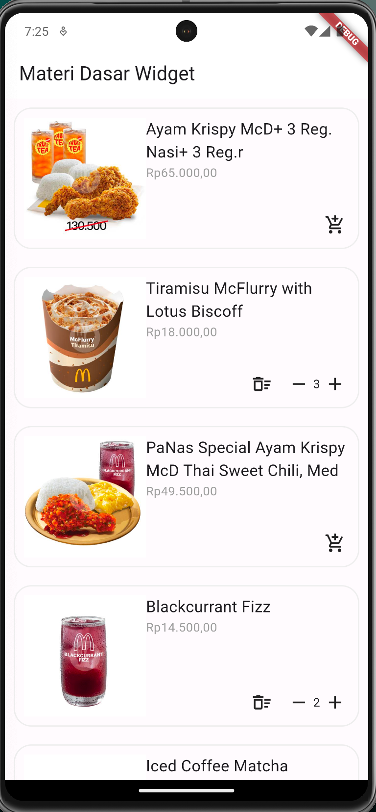
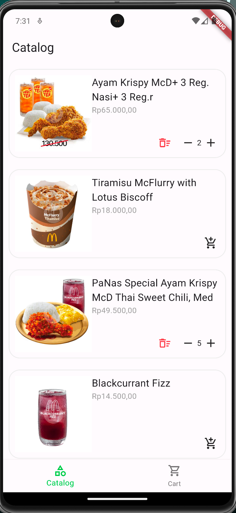
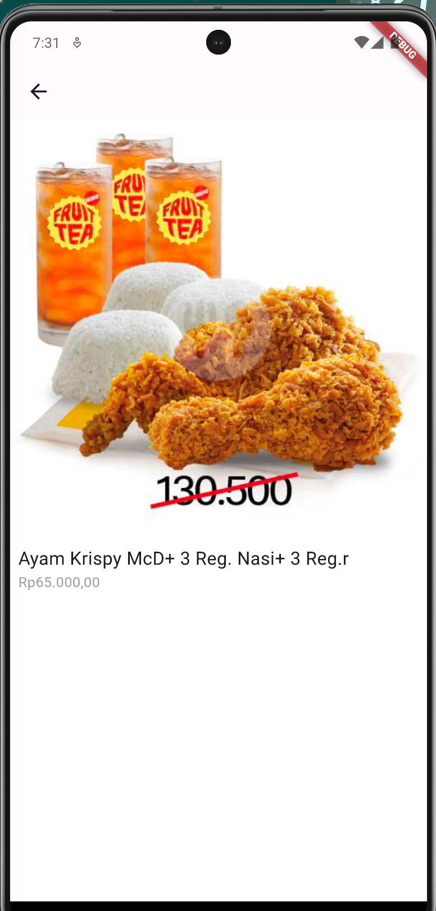
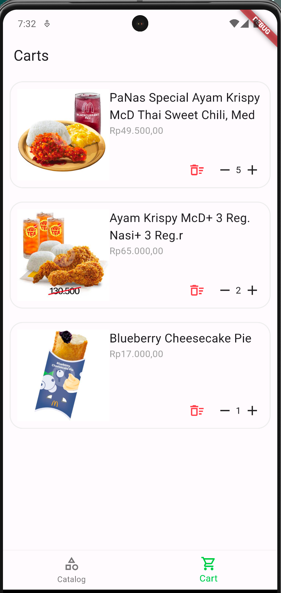
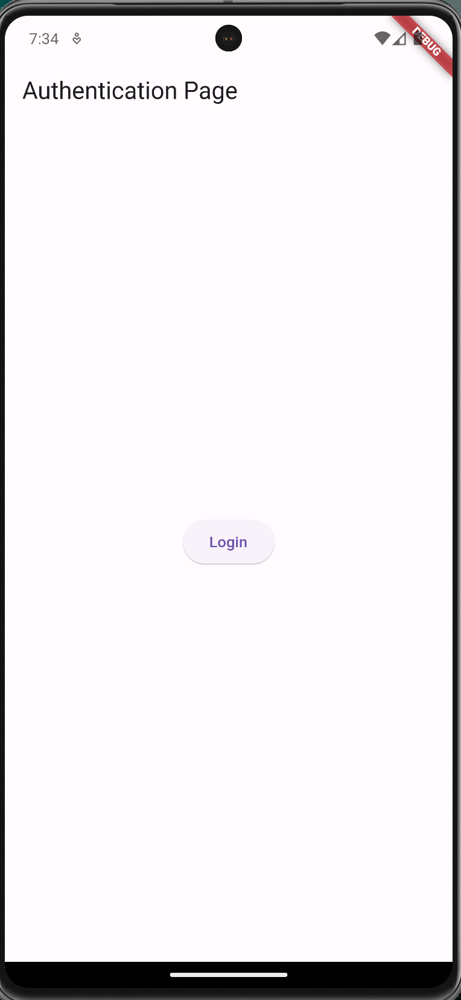
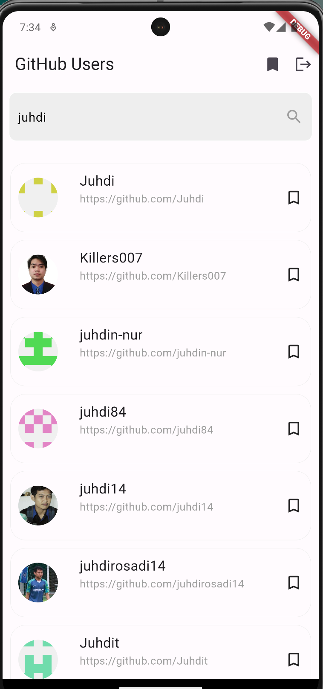
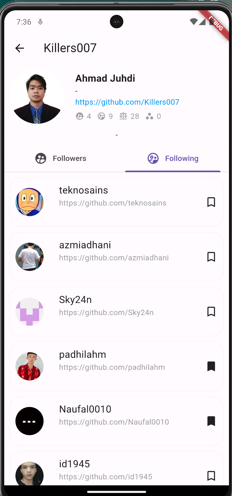
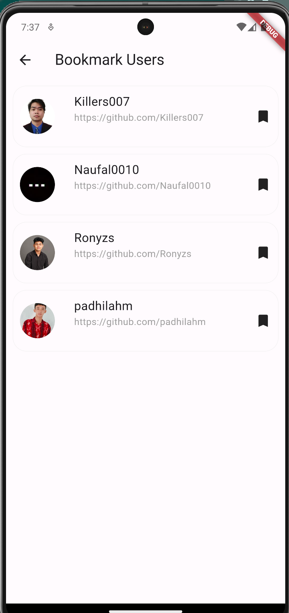
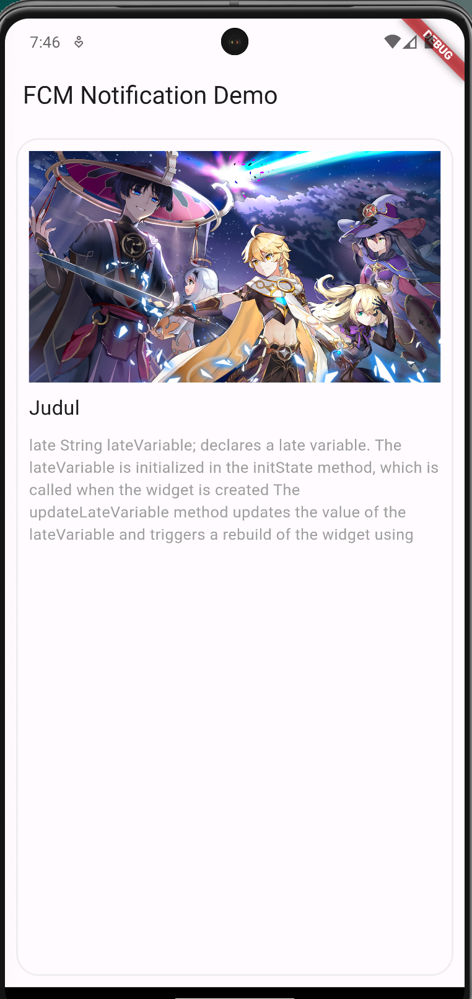
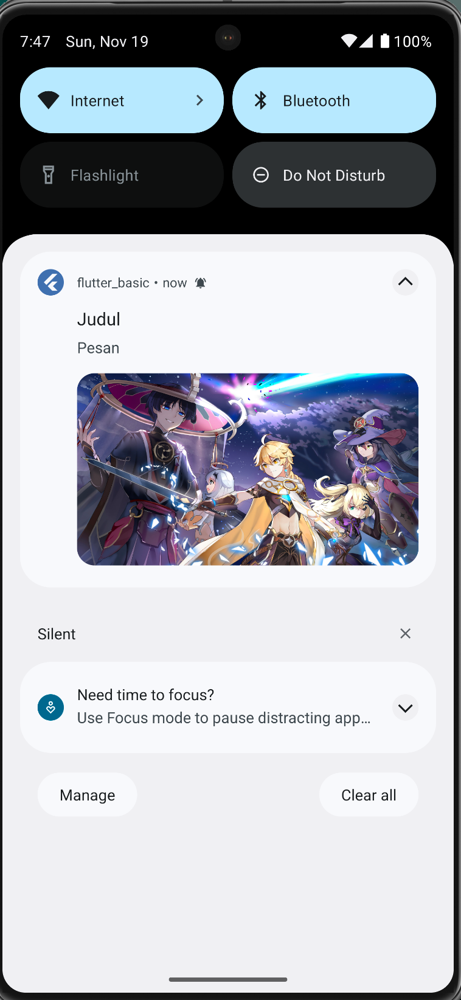

# Pelatihan Dasar Dasar Flutter

## Materi

Materi 1

* Membuat Project Baru
* Mengenal Struktur Folder
* Mengenal Dependencies

Materi 2

* Mengenal Variabel List & Map
* Mengenal Stateless Widget
* Mengenal Statefull Widget
* Mengenal Widget Dasar
  * Container
  * Row
  * Columns
  * Flexible

Materi 3

* Mengenal Navigasi routing halaman
* Mengenal Entities
* Mengenal State Management

Materi 4

* Mengenal local storage
* Membuat login sederhana
* Mengkonsumsi API

Materi 5

* Integrasi Firebase notification

### Studi Kasus

Materi 2 

Membuat List Produk

| Description                                                                                                                             | Screen                                         |
| :-------------------------------------------------------------------------------------------------------------------------------------- | ---------------------------------------------- |
| List katalog produk, menggunakan statefull widget untuk menambahkan jumlah produk tanpa merender ulang state produk yang lain |  |

Materi 3

Membuat List Produk & Keranjang

| Description                                                                                                                        | Screen                                         |
| :--------------------------------------------------------------------------------------------------------------------------------- | ---------------------------------------------- |
| Membuat state management  menggunakan `provider` agar produk yang ditambahkan otomatis muncul di halaman yang berbeda |  |
| Membuat routing ke halaman produk                                                                                                  |  |
| Menampilkan data produk yang ditambahkan ke keranjang menggunakan state management                                            |  |

Materi 4

Membuat Login sederhana & pencarian data user Github

| Description                                                                                                                              | Screen                                                                                             |
| :--------------------------------------------------------------------------------------------------------------------------------------- | -------------------------------------------------------------------------------------------------- |
| Login sederhana menggunakan local storage, agar saat aplikasi digunakan kembali maka tidak perlu melakukan authentikasi ulang. |                                                      |
| Mencari data user github berdasarkan keyword nama user atau id user                                                                 |                                                      |
| Menampilkan data user beserta data followers & following berdasarkan user id                                                       |   |
| Membuat Bookmark menggunakan local storage                                                                                               |                                                      |

Materi 5

Notifikasi menggunakan firebase

| Description                                                        | Screen                                         |
| :----------------------------------------------------------------- | ---------------------------------------------- |
| Membuat notifikasi muncul pada saat aplikasi sedang digunakan |  |
| Membuat notifikasi muncul saat aplikasi tidak digunakan       |  |
